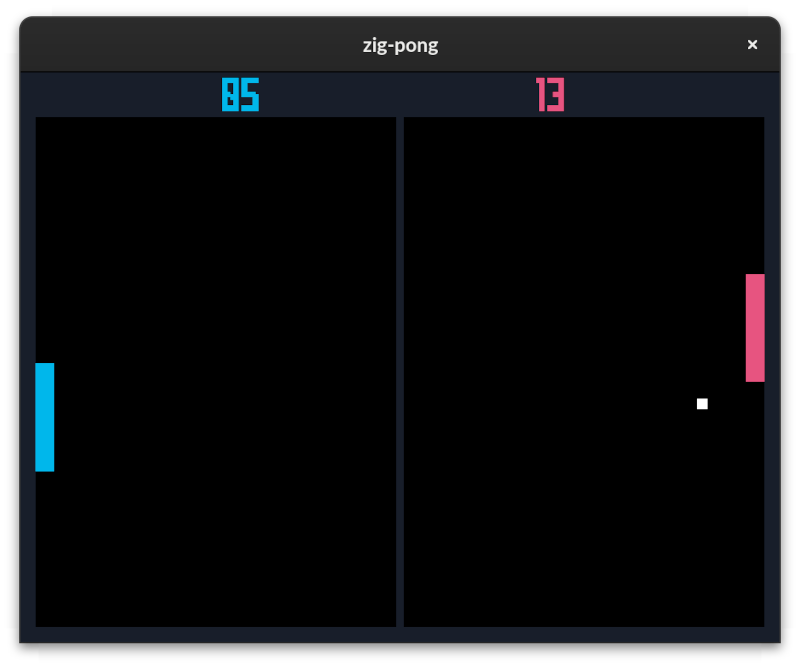

# zig-pong

My implementation of `pong` in [zig](https://ziglang.org/) in order to learn game development.



For rendering, I'm using the [delve framework](https://github.com/Interrupt/delve-framework). For collision and physics I use [zbox2d (box2d for zig)](https://github.com/stefanpartheym/zbox2d).

While a whole physics engine for a simple pong game is a total overkill, the educational value was actually worth it.

## Running the game

```sh
zig build run
```

## Assets

List of all the assets used in this game:

| File                          | Source                                             |
| ----------------------------- | -------------------------------------------------- |
| `assets/fonts/Mecha.ttf`      | [dafont.com](https://www.dafont.com/mecha-cf.font) |
| `assets/fonts/Mecha_Bold.ttf` | [dafont.com](https://www.dafont.com/mecha-cf.font) |
